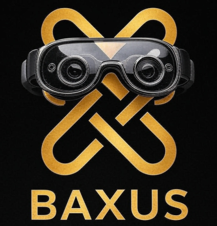

<div align="center">



</div>

# Whisky Baxus Goggles

A web application that identifies whisky labels through images captured by webcam using the Google Cloud Vision API.

## Requirements

- Node.js (version 16 or higher)
- A Google Cloud Vision API key

## Installation

1. Clone the repository:
   ```
   git clone https://github.com/6u5t4v05ouz4/baxus-goggles.git
   cd baxus-goggles
   ```

2. Install dependencies:
   ```
   npm install
   ```

3. Configure the Google Cloud Vision API:
   - Create an account on [Google Cloud Platform](https://cloud.google.com/)
   - Enable the Google Cloud Vision API
   - Create an API key
   - For a detailed step-by-step guide on how to obtain your API Key, check the [full tutorial here](./TUTORIAL_GOOGLE_VISION.md).
   - Create a `.env` file in the project root following the template in `.env.example`:
   ```
   VITE_GOOGLE_CLOUD_VISION_API_KEY=your_api_key_here
   ```

## Running the Project

1. Start the development server:
   ```
   npm run dev
   ```

2. Access the application in your browser at `http://localhost:5173`

## How to Use

1. **Allow Camera Access**
   - When opening the application, your browser will request permission to access the webcam
   - Grant permission to continue

2. **Capture Image**
   - Position the whisky bottle in front of the camera
   - Click the camera icon button to capture the image
   - Alternatively, you can upload an image from your device

3. **Image Analysis**
   - The application will send the image to the Google Cloud Vision API
   - Wait while the analysis is processed (indicated by a spinner)

4. **Results**
   - The application will display the analysis results
   - Matching whiskies will be shown in order of confidence
   - For each match, you will see the name, brand, type, and (when available) age of the whisky

5. **New Analysis**
   - To analyze another bottle, click "New Capture" and repeat the process

## Troubleshooting

- **Camera error**: Check if your browser has permission to access the webcam
- **Inaccurate results**: Make sure the image is well-lit and the label text is visible
- **API error**: Verify that your API key is correct and has the necessary permissions

## Technologies Used

- React with TypeScript
- Material UI for interface
- Google Cloud Vision API for image analysis
- Vite as build tool

## License

MIT License

Developed by _Grottan City Lab_

